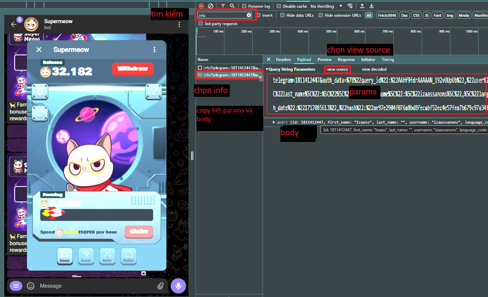

## Sử dụng node js để khai thác game Supper meow
### Tham gia trò chơi tại đây: https://t.me/supermeow_vip_bot?start=1811412447
### bước 1: chạy lệnh: npm i node-fetch
### bước 2: lưu code & đặt tên file là meow.mjs
### bước 3: điền body và params vào url
### bước 4: chạy lệnh: node meow.mjs
## Using node js to mining game Supper meow
### Join game here: https://t.me/supermeow_vip_bot?start=1811412447
### step 1: run: npm i node-fetch
### step 2: save code as meow.mjs
### step 3: fill body and param to url
### step 4: run: node meow.mjs

    
     

